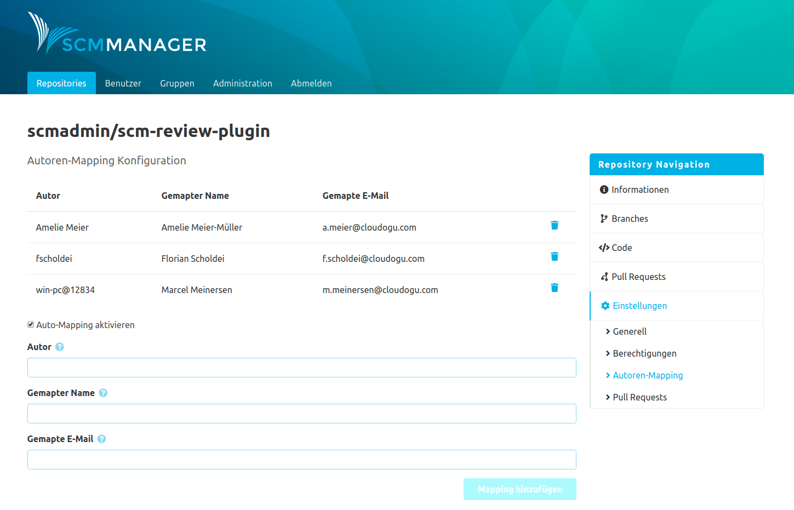

Die Konfiguration ist innerhalb eines Repositories unter dem Tab "Autoren-Mapping" zu finden. Nach Aktivierung erscheint beim Aufruf des Bereichs eine Liste aller gemappten Autoren. Über das Formular unterhalb der Liste lassen sich weitere Mappings definieren.

Das Autoren-Mapping Plugin löst den Autorennamen des Benutzers in der folgenden Reihenfolge auf:
- Mapping Konfiguration
- Cache (sonia.cache.authormapping)
- SCM-Manager Benutzerdatenbank
