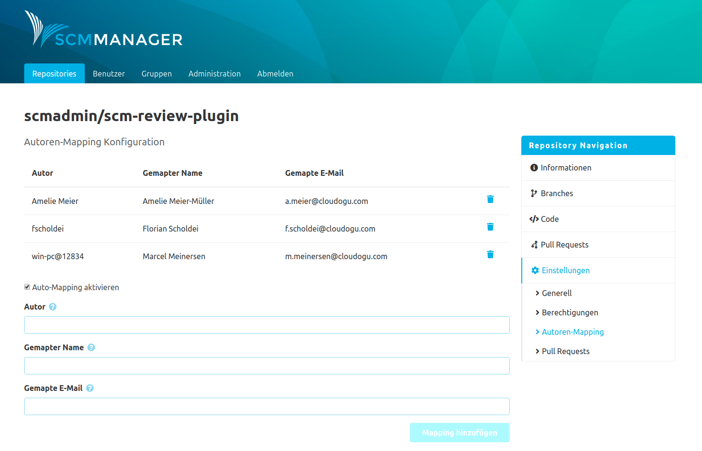

The configuration can be found in each repository in the tab "Author Mapping". Once activated, the configuration page shows a list of all authors that are being mapped. The form below the list can be used to add new mappings.

